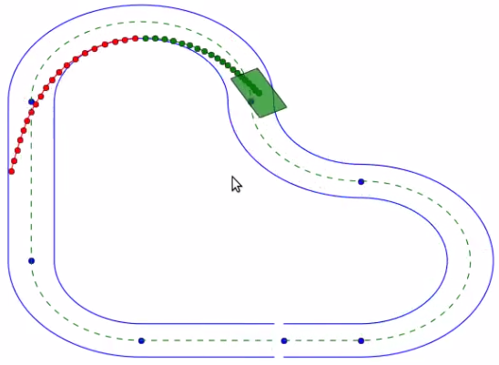

# LPV-MPP-MPC
Planning and control for autonomous racing vehicles

This project allows you to solve the autonomous racing driving problem using advanced control theory. 
Particularly, here it is presented a collaborative work using optimal strategies. The MPC strategy is used online for computing the optimal trajectory maximizing vehicle velocity but also for computing the optimal control actions that make the vehicle to follow the computed references.

### Prerequisites


### The vehicle model
[]


### MPC for planning


### MPC for control
At this point a Model Predictive Controller is built and solved at every control iteration for finding the optimal control actions (linear and angular velocities).


## Running the tests

For running this project you have to do:
```
  - catkin_make (to create build and devel folders)
  - source devel/setup.bash
  - roslaunch barc MAIN_LAUNCH.launch
  
```


## Video
[](https://www.youtube.com/watch?v=NrFt6ZmRRY0)


## References
* Eugenio Alcalá, Vicenç Puig and Joseba Quevedo. planner ...
* Eugenio Alcalá, Vicenç Puig and Joseba Quevedo. controller...


